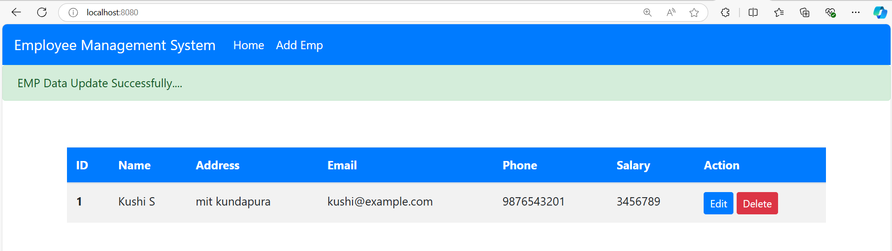

# Employee CRUD Application

This is an Employee Management System built using **Spring Boot** and **Thymeleaf**. The application allows you to perform CRUD (Create, Read, Update, Delete) operations on employee data, including adding new employees, viewing all employees, editing employee details, and deleting employees.

## Features

- Add new employees
- View a list of all employees
- Edit employee information
- Delete employees

## Technologies Used

- **Spring Boot**: Backend framework
- **Thymeleaf**: Frontend templating engine
- **H2 Database**: In-memory database for development and testing
- **Maven**: Dependency management and build tool

## Screenshots

### Employee List Page



### Add Employee Page


## How to Run

1. Clone the repository:
   ```bash
   git clone https://github.com/Kushi653/emp_crud.git
